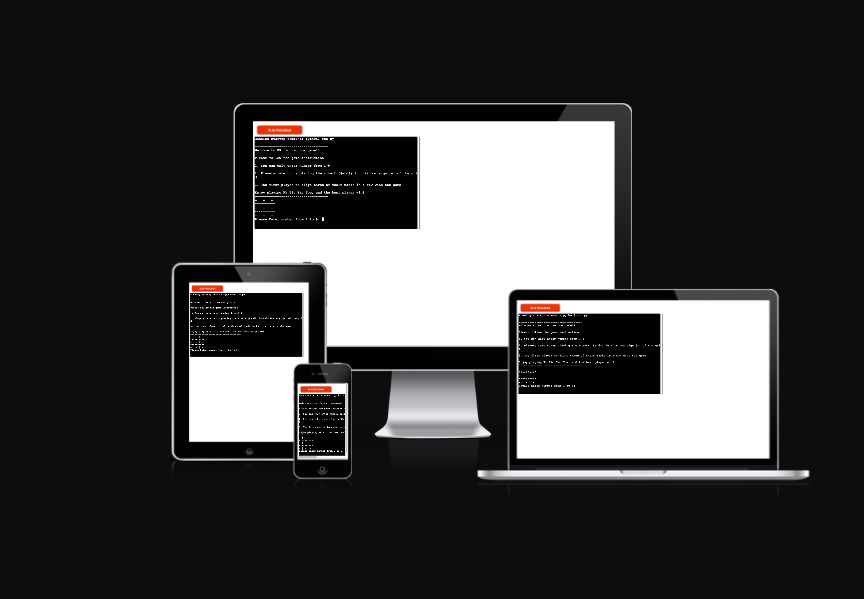

# RK Tic tac toe
RK tic tac toe game is designed for both parent and children, users can play with python terminal.
The terminal is runs in the code institute mock terminal on Heroku

The game will switch Player turn. The game have two symbol @ and $

[Click Here to view RK Tic tac toe game](https://rk-tic-tac-toe-56d87feb493d.herokuapp.com/)
---

## Table of contents

### [How to play rk tic tac toe](#How-play-rk-tic-tac-toe)

### [Logic Flowchart](#How-play-rk-tic-tac-toe)

### [User Experience (UX)](#Logic-Flowchart)
* [User Storie](#user-stories)

### [Features](#Feautures)
* [Existing Feature](#Existing-Features)

### [Design](#desing)

### [Technology used](#technologies-used)

### [Framework,Libraries and language used](#frameworkslibraries-and-language-used)

* [gitpot workspace](gitpot-workspace)
   * To write my code

* [Git](Git-1)
   * for Version control

* [Github](Github-1)
   * Deployment of the website

* [Draw.io](Draw.io-1)
   * To design the game flowchart of my tic tac toe game.

* [Heroku](Heroku-1)
   * Deploy the tic tac project

* [CI Python Linter](CI-Python-Linter)
   * I used this to check my code error or issues.

### [Testing](#testing-1)

* [Manual Testing](#manual-testing)

* [Fixed Bugs](#Fixed-Bugs)

### [Deployement and local development](#deployement-and-local-development)
* [Deployment to Heroku](#Deployment-Heroku)
* [forking the Github Respository](#forking-the-github-respository)
* [Local clone](#local-clone)
### [Credits](#credits)
### [Aknowledgement](#aknowledgement)
---

## How to play rk tic tac toe

Game implementation. Players take turns placing marks in the nine sqaures of the grip. and the game will end when 
one player successfully align three marks or when all squares are filled.
This game will display the result e.g: tie if no player won or won.

## Logic Flowchart

## User Experience (UX)

The game is very easy to play and simple,It accessible for people of all ages. This game will help children to develop problem-solving skills.
How this game work the first to place three of the marks in a row, either horizontally, vertically, or diagonally will win the game.

### User Storie

* First time visitor objective
    * Game instruction.
    * User will start the game after reading the instruction.
    * This game is very easy to play.

* Returning 
    * User after game satisfaction return to play again.
    * User share the tic tac toe game with their family member and close friends.

* Frequent user objective
    * make the game a bit hard.
    * Exploring new features
    * Possibility to invite people to play online.

## Features 

* Game menu for user to select levels.
* Option Play again

### Existing Features

* Game introduction
* Welcome message for the users.

* The rule of the game 
   * You can only enter number from 1-9
   * Players take turns
   * Player 1to align three of their marks in a row wins the game

Ask the user to enter number

Display the game winner message 

## Features left to implement 

* Score system
* Multiple player option

---

## Design 

* User pen and paper to design my game.

* Flowchart
    * [Draw.io](https://app.diagrams.net/)

---

## Technologies used

* [Python](https://en.wikipedia.org/wiki/Python_(programming_language))

## Framework,Libraries and language used

* [gitpod](https://gitpod.io/workspaces)

* [Git](https://git-scm.com/)
   * for Version control

* [Github](https://github.com/)
   * Deployment of the website

* [Draw.io](https://app.diagrams.net/)
   * To design the game flowchart of my tic tac toe game.

* [Heroku](https://heroku.com/)
   * Deploy the tic tac project

* [CI Python Linter](https://pep8ci.herokuapp.com/)

## Testing 

used CI Python Linter to test my python code run.py

 run.py CI Python Linter check code

## Fixed Bugs
No bug found

## Deployment 

### Deploying to Heroku

I deployed my project with Heroku, code Institute Python Template.

1. Log in to Heroku or create a new account
2. On the main page click "New" and select "Create new app"
3. Choose your unique app name and select your region
4. Click "Create app"
5. On the next page find "settings" and locate "Config Vars"
6. Click "Reveal Config Vars" and add "PORT" key and value "8000", click "Add"
7. Scroll down, locate "Buildpack" and click "Add", select "Python"
8. Repeat step 7. only this time add "Node.js", make sure "Python" is first
9. Scroll to the top and select "Deploy" tab
10. Select GitHub as deployment method and search for your repository and link them together
11. Scroll down and select either "Enable Automatic Deploys" or "Manual Deploy"
12. Deployed site [rk-tic-tac-toe](https://rk-tic-tac-toe-56d87feb493d.herokuapp.com/)

### Deployment and local development 

By forking the repository, we make a copy of the original repository on our GitHub account to view and change without affecting the original repository by using these steps:

1. Log in to GitHub and locate [GitHub Repository rk tic tac toe](https://github.com/RamyApepone/Rk-tic-tac-toe.git)

2. At the top of the Repository(under the main navigation) locate "Fork" button.

3. Now you should have a copy of the original repository in your GitHub account.

### Local clone

1. Log in to GitHub and locate [GitHub Repository rk tic tac toe](https://github.com/RamyApepone/Rk-tic-tac-toe.git)

2. Under the repository name click "Clone or download"

3. Click on the code button, select clone with HTTPS, SSH or GitHub CLI and copy the link shown.

4. Open Git Bash

5. Change the current working directory to the location where you want the cloned directory to be made.

6. Type `git clone` and then paste The URL copied in the step 3.

7. Press Enter and your local clone will be created.

# Credits
Code institute

### Code

w3School
discuss.python.org

# Acknowledgement
My mentor Mitko for all the support during my Python project. 

